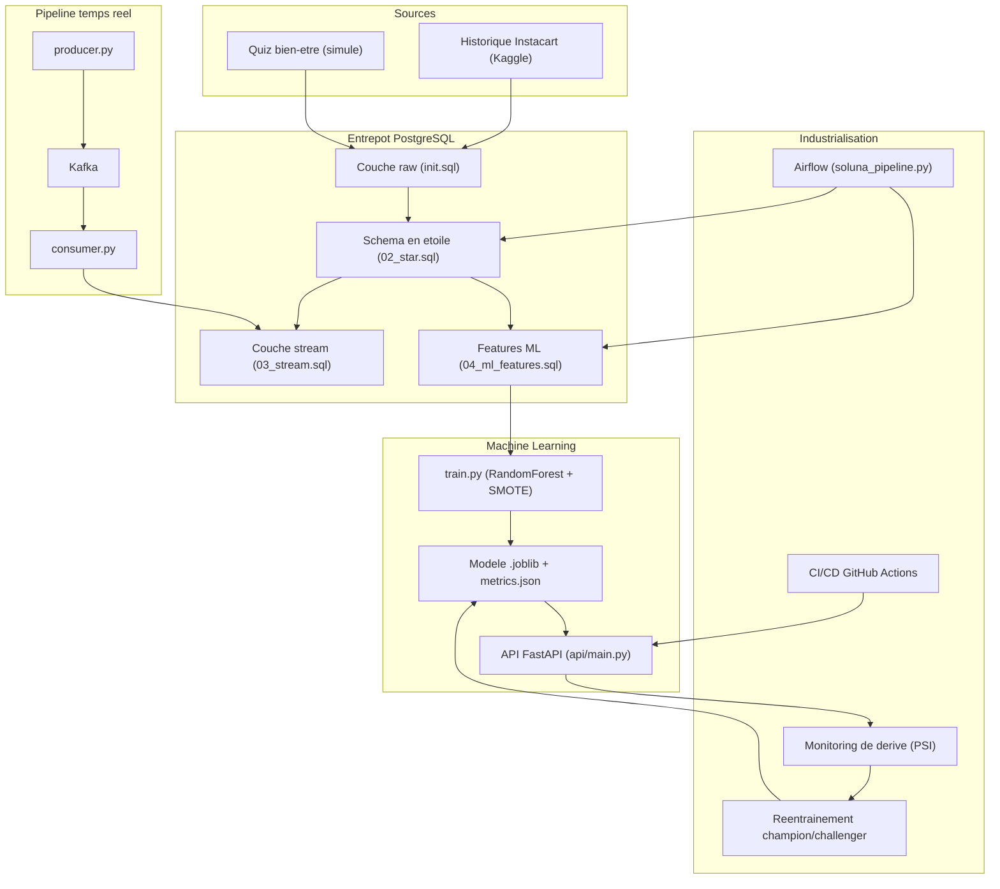
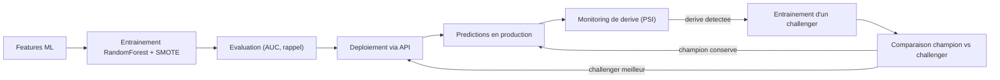
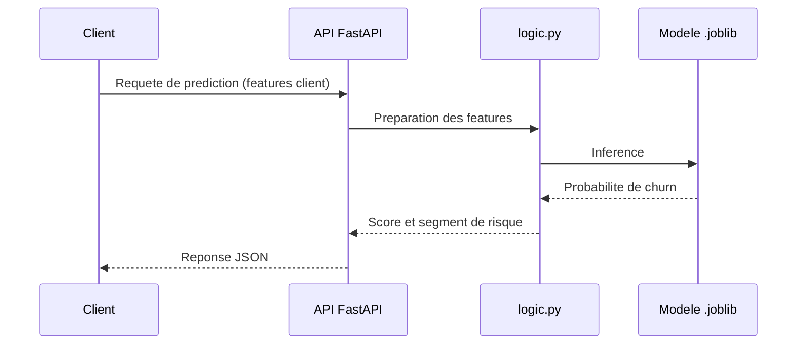

# Soluna, plateforme Data et IA

Projet fil rouge construit autour de *Soluna*, une marque fictive de compléments alimentaires personnalisés vendus par abonnement. L'objectif transverse est de transformer un achat ponctuel en abonnement durable, ce qui revient à piloter la rétention et à anticiper le churn.

Le dépôt couvre une chaîne complète, de l'ingestion des données jusqu'au serving d'un modèle de prédiction en production, avec la couche d'industrialisation associée (orchestration, conteneurisation, intégration continue, surveillance de dérive).

> **Données.** L'historique de commandes s'appuie sur le jeu Instacart Market Basket Analysis (Kaggle), utilisé comme proxy de la cadence de réachat. Le quiz de bien-être est simulé. Soluna est une entité fictive, sans lien avec une marque réelle.

## Contexte et objectif

La question métier est simple à formuler et difficile à résoudre : un client qui vient de commander va-t-il revenir, et si le risque de départ est élevé, comment le détecter assez tôt pour agir. Le projet répond à cette question par une cible explicite : un client est considéré comme churné si l'écart depuis sa dernière commande atteint ou dépasse 30 jours. Le reste de la plateforme sert à produire, alimenter et exploiter ce signal de façon reproductible.

## Architecture globale



Les données brutes alimentent une couche raw dans PostgreSQL, puis sont structurées en schéma en étoile. Deux chemins partent de là : une table de features pour le machine learning et une couche de streaming alimentée en continu par le pipeline Kafka. Le modèle s'entraîne sur les features, puis est servi par l'API. L'orchestration Airflow déclenche les étapes de transformation, tandis que le monitoring et le réentraînement ferment la boucle de maintien en condition opérationnelle.

## Cycle de vie du modèle



Le modèle n'est pas figé après son premier entraînement. La surveillance de dérive mesure l'écart de distribution entre les données d'entraînement et les données récentes via l'indice PSI. Lorsqu'une dérive est détectée, un modèle challenger est entraîné puis comparé au modèle en place. Le champion n'est remplacé que si le challenger fait mieux, ce qui évite les régressions silencieuses.

## Parcours d'une prédiction



La logique métier est isolée dans `logic.py`, séparée de la couche de transport `main.py`. Cette séparation permet de tester la préparation des features et le calcul du score sans démarrer le serveur. Les noms de routes exacts sont visibles sur la documentation interactive à l'adresse `http://localhost:8000/docs`.

## Structure du dépôt

| Dossier | Contenu |
| --- | --- |
| `sql/` | `init.sql` (couche raw), `02_star.sql` (schéma en étoile), `03_stream.sql` (couche temps réel), `04_ml_features.sql` (features) |
| `python/` | `producer.py` et `consumer.py`, pipeline temps réel Kafka |
| `dags/` | `soluna_pipeline.py`, orchestration Airflow (qualité et segmentation) |
| `src/` | `train.py`, entraînement du modèle anti-churn |
| `api/` | `main.py` (FastAPI) et `logic.py`, serving des prédictions |
| `retrain/` | `retrain.py`, réentraînement champion/challenger avec journal |
| `monitoring/` | `drift_check.py`, surveillance de dérive par PSI |
| `tests/` | tests unitaires sur la logique métier et la cohérence du modèle |
| `models/` | `metrics.json` et `features.json` (le modèle `.joblib` se régénère) |
| `notebooks/` | `exploration_churn.ipynb`, analyse exploratoire |
| `.github/workflows/` | `ci.yml` (tests) et `retrain.yml` (réentraînement planifié) |
| `k8s/` | manifestes de déploiement Kubernetes |
| `terraform/` | infrastructure as code |
| `docker-compose.yml`, `dockerfile`, `requirements.txt` | infrastructure locale et dépendances |

## Stack technique

PostgreSQL pour l'entreposage, Docker et docker-compose pour l'environnement local, Apache Kafka pour le streaming, Apache Airflow pour l'orchestration. Le machine learning repose sur Python avec scikit-learn, imbalanced-learn et FastAPI. L'intégration continue est gérée par GitHub Actions, le déploiement par Kubernetes et le provisionnement par Terraform.

## Démarrage rapide

```bash
# 1. Entrepot et outils (PostgreSQL, Adminer, Kafka, Airflow)
docker compose up -d

# 2. Chargement des donnees (raw vers mart vers stream vers ml)
docker compose exec -T warehouse psql -U soluna -d soluna < sql/init.sql
docker compose exec -T warehouse psql -U soluna -d soluna < sql/02_star.sql
docker compose exec -T warehouse psql -U soluna -d soluna < sql/03_stream.sql
docker compose exec -T warehouse psql -U soluna -d soluna < sql/04_ml_features.sql

# 3. Pipeline temps reel (deux terminaux)
python python/producer.py
python python/consumer.py

# 4. Entrainement du modele anti-churn
python src/train.py

# 5. API de serving
uvicorn api.main:app --port 8000
# Alternative conteneur : docker build -t soluna-api . && docker run -p 8000:8000 soluna-api
# Documentation : http://localhost:8000/docs

# 6. Tests, reentrainement, monitoring
python -m pytest -v
python retrain/retrain.py
python monitoring/drift_check.py
```

## Modèle anti-churn

La cible vaut 1 lorsque l'écart depuis la dernière commande atteint ou dépasse 30 jours. Le modèle est un RandomForest combiné à un sur-échantillonnage SMOTE, la classe minoritaire représentant environ 30 pour cent des observations. Les performances obtenues sont une AUC d'environ 0,70 et un rappel sur la classe à risque d'environ 0,53. Le choix d'un modèle simple est assumé, au profit de l'explicabilité et de la facilité de maintenance.

L'industrialisation repose sur quatre piliers : une API FastAPI conteneurisée, une intégration continue via GitHub Actions, un réentraînement champion/challenger planifié et un monitoring de dérive fondé sur le PSI.

## Limites et pistes d'amélioration

Le modèle actuel privilégie la simplicité, ce qui laisse une marge de progression sur la performance. Plusieurs directions sont envisageables : enrichir les features avec des variables comportementales issues du quiz et de la saisonnalité de réachat, tester des modèles à base de gradient boosting, calibrer les probabilités pour rendre les seuils de risque plus exploitables côté métier, et formaliser un seuil de décision aligné sur le coût d'une action de rétention plutôt que sur l'AUC seule.

Côté plateforme, la couche de streaming et la couche d'entraînement restent découplées. Un suivi de la latence entre l'événement de commande et la mise à jour des features permettrait de mesurer la fraîcheur réelle du signal exploité par le modèle.
